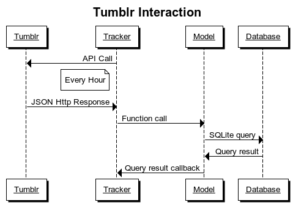
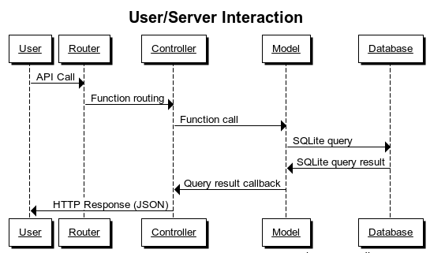

% CSC309 Assignment 2
% Michael Kozakov, Natalie Morcos, Zeeshan Qureshi
% 12 Mar 2013

Requirements
============

  + Node.js
  + SQLite3
  + Sequelize - (Object Relational Map used my models.js)
  + Express - (for routing API requests)
  + Cheerio - (For scraping text from HTML)
  + Request - (Module for nicer HTTP requests)
  + Forever - (Monitor server and restart on crash)

Usage
=====

Install Dependencies :

    $ npm install

Start Server:

    $ ./node_modules/.bin/forever app.js

RESTful API
===========

`POST /blog`
 :    Add blog to the list of tracked blogs. \
      *@param* `blog` A string indicating a new blog to track by its {base-hostname}

`GET /blog/{base-hostname}/trends`
 :    Get a listing of posts liked by the given blog \
      *@param* `limit` maximum number of posts to display \
      *@param* `order` {"Trending" / "Recent"} sorting order in which the posts will be displayed

`GET /blogs/trends`
 :    Get a listing of posts liked by all tracked blogs \
      *@param* `limit` maximum number of posts to display \
      *@param* `order` {"Trending" / "Recent"} sorting order in which the posts will be displayed

Project Structure
=================

The node.js app creates an HTTP server and listens for incoming requests.
The requests are dispatched to respective methods in controller.js using 
methods from the express.js library. If a route doesn't have a matching 
function, then 404 is returned.

All the interaction with the database is done through the functions defined
in models.js. Using the sequelize.js library, model.js defines an SQLite 3
database, and the relevant query functions.

Controller.js uses the methods defined in models.js to peform the respective
queries. The query results are then properly formatted and JSON data is 
returned through an HTTP response. 

In addition, Tracker.js makes hourly calls to the Tumblr API to collect
updated information for the tracked blogs. The information is passed
to the database throught the functions in models.js.

`app.js`

 :    The bare node.js server that listens to HTTP requests and routes to
      methods in `controller.js`.

`controller.js`

 :    The main server logic of the REST API lives here.

`tracker.js`

 :    Automatically collects information about tracked blogs from tumblr every hour.

`model.js`

 :    Initializes the database (if it doesn't exist), and contains functions that query the database.

Sequence Diagrams
=================

  
    

Database Structure
==================

`dq.sqlite`

Blogs(blogName)

Posts(id, likedBy, url, date, text, image, type, last_track, last_count, increment, sequence, tracking)

        notes:

          likedBy : References blog(blogName).  

          date :  Date the post was authored.

          tracking : Tracking history serialized as JSON.

